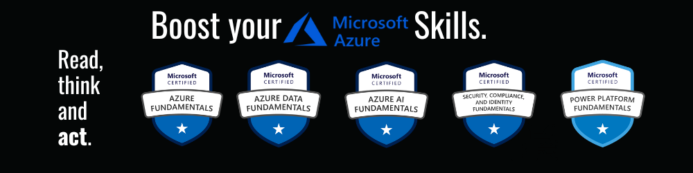

# [CloudBoost - Compressed Material](https://cloud.itzyahya.tech)



> an alternative [reading interface](https://yaya2devops.github.io/CloudBoost/) for the content below?

A project to help people crash that certification, built on NextJs, containing notes of mine about my cloud journey from blogs, documentations & personnal experience.

## Are you new here? Start from this [point.](/posts/a-az900.md)

  
## Progress

  **The platform has the examinations below with the intent of constantly improving and appending more beneficial content for the community.**
  
| Current List  | Exam Code  | Status |
|:-------- |:--------:| --------:|
| Microsoft Azure Fundamentals      |  [AZ-900](/posts/a-az900.md)   |     [✔️] |
| Microsoft Azure Data Fundamentals      |   [DP-900](/posts/dp900.md)   |     [✔️] |
| Microsoft Azure AI Fundamentals      |  [AI-900](/posts/b-ai900.md)   |     [✔️] |


## Proceed contributing to this project and start earning good value
As you can see, you have all of the necessary code. What you can do now is fork it on your local machine, add your value, and push it back to me. Send me a pull request, and I'll definitely put your value into production.

**We intend to continue working on these exams as well as improving what is already in place.**
 - [ ] AZ-104: Microsoft Azure Administrator 
 - [ ] AZ-204: Developing Solutions for Microsoft Azure 
 - [ ] AZ-500: Microsoft Azure Security Technologies  
 - [ ] AZ-700: Designing and Implementing Microsoft Networking Solutions
 - [ ] AZ-400: Designing and Implementing Microsoft DevOps Solutions 
 - [ ] AZ-305: Designing Microsoft Azure Infrastructure Solutions 
 - [ ] Terraform: HashiCorp Infrastructure Automation Certification 

**So you must have something to say. Simply dive in and deliver great knowledge to the world.**

##  :bulb: How to contribute?
👍 You want to either add a new certificate or improve an existing one.  
- You can add a new certificate to the list by following this hirarchy 👇

 
``` 
.CloudBoost
├── components
├── lib
├── pages
├── posts
│   ├── a-az900.md // You can contribute here
│   ├── b-ai900.md // Also Here
│   ├── dp900.md // Also Here
│   ├── e-sc900.md // Also Here
│   ├── f-pl900.md // Also Here
│   ├── g-YourContribution.md ?
├── public
├── styles
```

To display the certification badge you decided to work on, on the UI, add the modifications to "text.js" as shown below.
``` 
.CloudBoost
├── components
│   ├── entry
│      ├── text.js
├── lib
├── pages
├── posts
├── public
├── styles
```
Just do it✔️; it could be the thing that opens doors you never imagined.
> Whatever insights you gained, I passionately welcome them. :tada:


